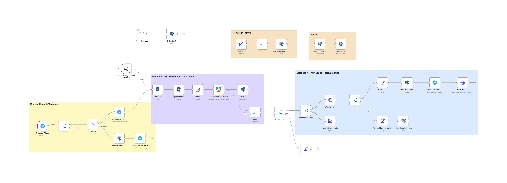

# Husnain Mehmood

### AI Automation Engineer · n8n & Agentic Workflow Specialist · Backend Developer

I build production systems that move **information, decisions, and follow-up** through a business.

> **Have a slow, manual, or fragile handoff in your business?** Email me the workflow in 2-3 lines, or [book a call](https://calendar.app.google/2mrdxZvQCn7Vrawh8). Every manual handoff is a lead, task, or follow-up that can go cold.

## About Me

I am a hands-on **AI Automation Engineer and technical founder/team lead**. I design, build, deploy, and improve workflow systems that connect business operations to reliable technical routes.

My work spans n8n orchestration, API integrations, AI classification and scoring, private RAG, semantic search, voice agents, databases, backend systems, and internal operational tools.

I focus on the process first, then choose the simplest architecture that can be tested, maintained, and handed over.

## My Stack

  
  
  
  
  
  
  
  

## Selected Systems I Have Built

| System | What it does | In plain words | Technologies |
| --- | --- | --- | --- |
| **Lead Generation Pipelines** | Scrapes, enriches, scores, deduplicates, and routes qualified leads into outreach workflows. | Saves about **3 hours of manual work every day**, and only qualified leads reach your sales team. | Apify · Groq · Apollo.io · PostgreSQL · SmartLead · n8n |
| **[Parent-Document RAG Chatbot](https://github.com/HusnainMehmood5290/RAG)** *(open source)* | Embeds small chunks for precise search, then returns the full parent section to the LLM. Includes idempotent PDF ingestion, source citations, tests, and Docker. | A chatbot that answers from your own PDFs and shows exactly where each answer came from. | LangChain · ChromaDB · Gemini · Streamlit · Docker |
| **Private HR Knowledge Assistant** | On-premise RAG for SNGPL's HR division, with local inference and no external API calls. | Staff get HR answers instantly, and no data leaves the company. | LangChain · ChromaDB · Llama (local) · llama.cpp |
| **Software Finder Voice Agent** | Conducts structured inbound qualification and recommends vendors through semantic matching. | A voice agent that qualifies callers and matches them to the right vendor. | Retell AI · OpenAI · n8n · PostgreSQL |
| **Internal Business Tools** | Full-stack systems for access control, payment history, inventory, and analytics. | Your day-to-day operations in one dashboard instead of spreadsheets. | Python · FastAPI · React · PostgreSQL · Docker |

## Inside the Lead Generation System

**1. Lead discovery.** Scheduled or Telegram-triggered runs pull businesses from Google Maps by city, deduplicate them against the database, check that each website is live, and store raw or rejected leads in PostgreSQL, with Telegram alerts along the way.

**2. AI qualification.** Each lead's website is fetched and classified, an LLM picks which pages matter and extracts evidence about the business's stack and services, and a rules step decides the outcome. Every decision is saved with an audit log. Qualified leads are pushed to Google Sheets with contact emails, and daily reports go out by email, Telegram, and HTML.

## How I Work

1. **Discovery call:** you walk me through the process and where it breaks.
2. **Scope and plan:** inputs, outputs, error paths, and ownership are defined before building.
3. **Build and test:** the simplest architecture that works, tested against real data.
4. **Handoff:** documentation, monitoring, and a system your team can run.

**Best fit:** businesses with a repeated operational handoff (leads, follow-ups, document Q&A, qualification) that is slow, manual, or hard to track.
**Not a fit:** one-off demos or throwaway prototypes. I build for production.

## Engineering Principles

> Use AI where language, judgment, or similarity matters. Use deterministic rules where identity, thresholds, retries, and records must remain consistent.

Production automation needs more than a successful demo. It needs defined inputs and outputs, clear ownership, error paths, deduplication, approval boundaries, monitoring, and a maintainable handoff.

## Currently Focused On

- Production n8n and agentic workflow systems
- Private and on-premise RAG deployments
- Voice qualification and recommendation agents
- Lead generation, enrichment, scoring, and campaign operations
- SEO, content, and publishing automation
- Backend systems and custom internal tools

## Let's Talk

If a repeated operational handoff is costing you leads, time, or follow-ups, that is the kind of problem I like to fix.

- 📅 **[Book a call](https://calendar.app.google/2mrdxZvQCn7Vrawh8)**
- ✉️ **[husnainmehmood5290@gmail.com](mailto:husnainmehmood5290@gmail.com)**
- 💼 [LinkedIn](https://www.linkedin.com/in/husnainmehmood) · 🌐 [Portfolio](https://husnain.agenticflow.me)

**Build the route. Make the handoff dependable.**

